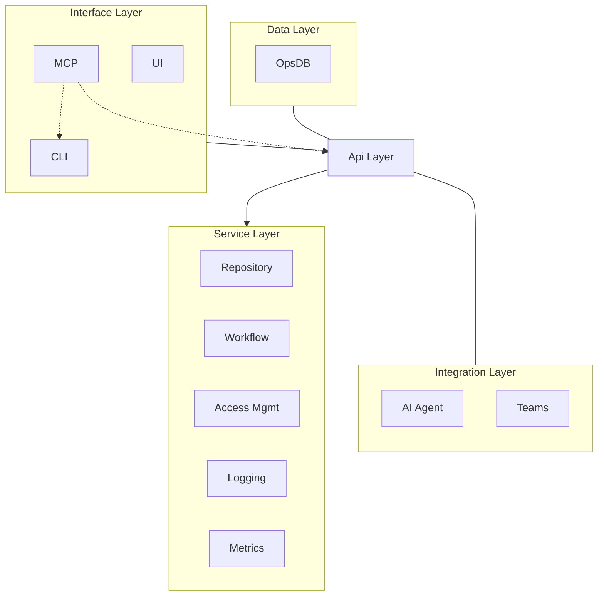

# Beehive Platform Diagram

```mermaid
flowchart TB
    subgraph interface_layer[Interface Layer]
        direction LR
        ui[UI]
        cli[CLI]
        mcp[MCP]
    end

    api_layer[Api Layer]

    subgraph service_layer[Service Layer]
        direction LR
        repository[Repository]
        workflow[Workflow]
        access_mgmt[Access Mgmt]
        logging[Logging]
        metrics[Metrics]
    end

    subgraph data_layer[Data Layer]
        opsdb[OpsDB]
    end

    subgraph integration_layer[Integration Layer]
        direction TB
        ai_agent[AI Agent]
        teams[Teams]
    end

    interface_layer --> api_layer
    api_layer --> service_layer
    data_layer --- api_layer --- integration_layer

    mcp -.-> cli
    mcp -.-> api_layer
```
